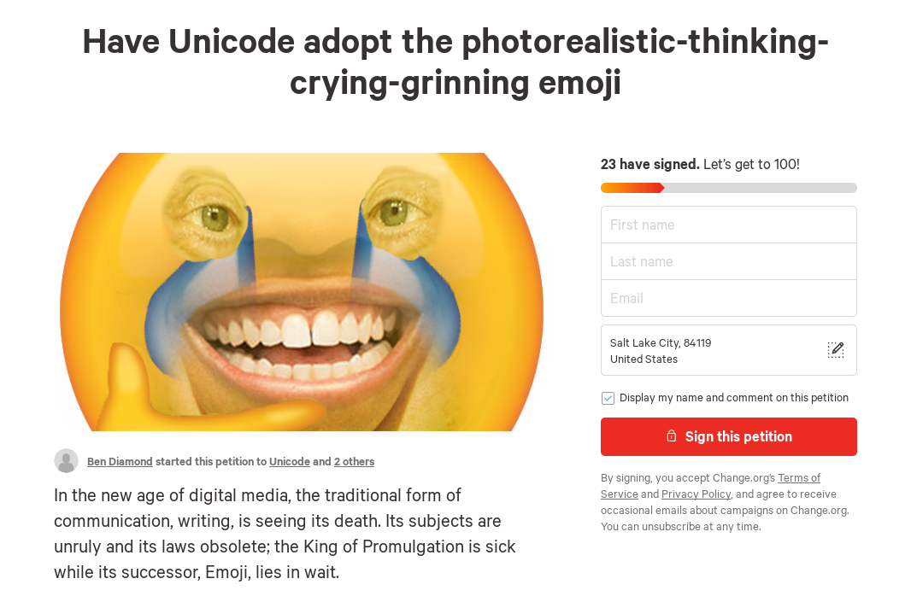

{:.caption}
You can support this (much needed) mission on [my change.org petition](https://www.change.org/p/unicode-have-unicode-adopt-the-photorealistic-thinking-crying-grinning-emoji "Change.org Petition Link")

In the new age of digital media, the traditional form of communication, writing, is seeing its death. Its subjects are unruly and its laws obsolete; the King of Promulgation is sick while its successor, Emoji, lies in wait.

The road to our pictograph future is being paved. Already, Oxford dictionary has acknowledged Emoji’s superiority; its 2015 “word” of the year was the laughing crying face. Two things result from this fact: 1) Emoticon is already acknowledged by all language powers to be itself a power and 2) It is high time that the truth should openly, in the face of the whole world, meet other powers with its own manifesto.

This recent ousting is a result of the modern globalization of communication. While the written word plays an all-too-integral role to be fully replaced, the new “hieroglyph language” offers numerous benefits in our new society, chiefly being its efficiency, nature, and ability to quickly communicate human emotion without need of words.

With this fundamental truth, why hasn’t this power already taken its God-mandated throne? Why hasn’t the spectre of written word been exorcised? The hieroglyph language has a fatal flaw: it lacks the photorealistic-thinking-crying-grinning emoji.

While the subjects of language’s kingdom support Emoji, many recognize viscerally its hamartia, even without knowing it. For centuries, we have (futilely) attempted to fully explain the inward feelings we face. It is the nature of our consciousness to question, but still, we have ultimately failed in answering the most basic internal question: what is that one emotion?

So why then, with time spanning the start of our existence, could we not answer this query?

The reason being is that we lack the language to explain the phenomenon that is consciousness. Even predating spoken language and the written word, thought alone is not enough to satisfy our needs. Only with Emoji can we begin to answer the Question of That Emotion, but Emoji in its current state cannot fully accomplish this task.

The photorealistic-thinking-crying-grinning emoji is the only emoji that can express an emotion that words cannot convey. It is what philosophers of centuries past have sought after. It is what has motivated the greatest poets, artists, and writers to create masterpieces. It is when you look down and finally realize the scale and complexity of our Earth, then that same emotion times a myriad-fold when you look up at the stars.

And yet when we grasp for the words to explain this sensation, we fall short, not because we cannot attempt clarification, but because the written language doesn’t have the capacity for expounding this.

So please, Unicode, for the good of humanity, approve the photorealistic-thinking-crying-grinning emoji.

Sincerely, everyone who has felt this emotion.
